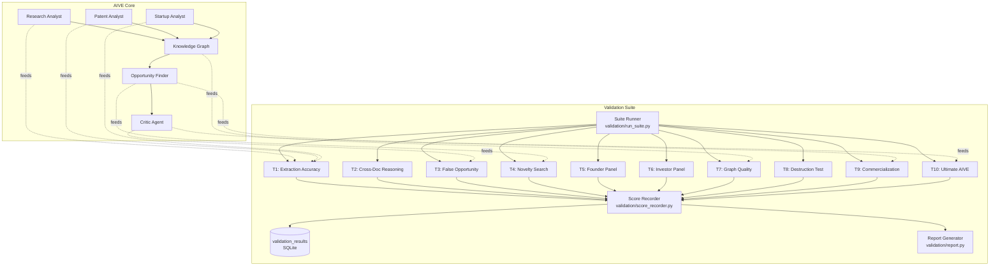
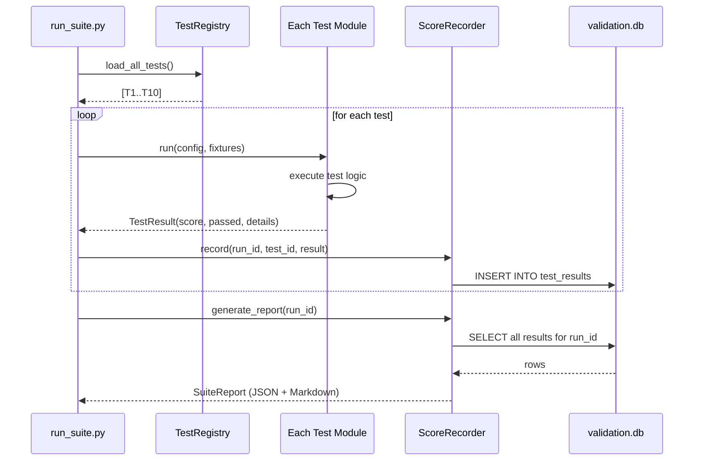
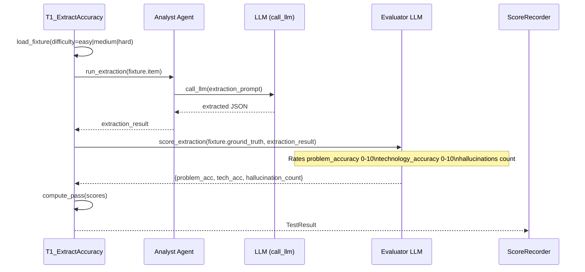
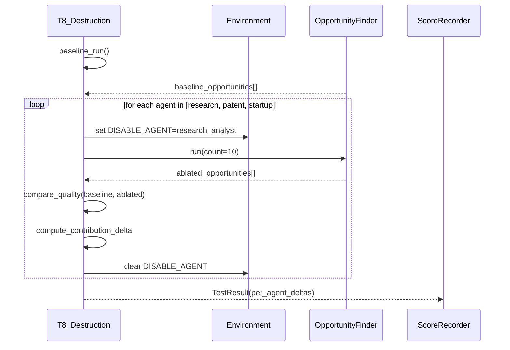

# Design Document: AIVE Validation Suite

## Overview

The AIVE Validation Suite is a comprehensive testing and measurement framework that answers the core AIVE question with evidence: *"Does this machine produce better insights than a human would find manually?"* It covers ten distinct test categories — from extraction accuracy and hallucination rates, through novelty search and graph quality, to human panels rating surprise and actionability. Each test produces a structured pass/fail verdict with numeric scores stored in a dedicated SQLite schema alongside the main AIVE database, making all results queryable and comparable across runs.

The framework integrates directly with the existing `agents/`, `db/`, and `graph/` modules. It does not replace the AIVE pipeline; it wraps it, observes its outputs, and issues a formal verdict per test. The result is a single command — `python validation/run_suite.py` — that runs all ten tests and produces a dashboard-ready JSON report.

---

## Architecture



### Key Architectural Decisions

- **Separate validation DB** — test results live in `data/validation.db`, never polluting `aive.db`. Both databases share the same SQLite runtime, so joins are possible via `ATTACH DATABASE`.
- **Test isolation** — each test module is independently runnable (`python validation/tests/t1_extraction.py`) and also callable from the suite runner. No test depends on another having run first.
- **Fixture-based inputs** — canned test inputs (easy/medium/hard papers, nonsense combos, multi-source packs) live in `validation/fixtures/` as JSON files, versioned so tests are reproducible.
- **Human-in-the-loop hooks** — tests T5, T6, and T10 require real human input. The framework pauses and waits, collecting responses via a simple CLI questionnaire or a minimal Flask form. Results are stored identically to automated tests.
- **Ablation support** — T8 (Destruction Test) temporarily disables agents via an environment flag read by each agent's `run()` function, rather than modifying any agent code.

---

## Sequence Diagrams

### Suite Runner — Full Run



### T1 — Extraction Accuracy Test



### T8 — Destruction Test (Ablation)



---

## Components and Interfaces

### Component 1: TestBase (`validation/base_test.py`)

**Purpose**: Abstract base class all ten test modules inherit from. Enforces a consistent interface.

**Interface**:
```python
class TestBase:
    test_id: str           # e.g. "T1_extraction_accuracy"
    test_name: str
    pass_threshold: dict   # metric name → minimum value to pass

    def run(self, config: dict, fixtures: dict) -> TestResult: ...
    def load_fixtures(self, fixture_path: Path) -> dict: ...
    def compute_pass(self, scores: dict) -> bool: ...
```

**Responsibilities**:
- Declare test metadata (ID, name, thresholds)
- Load and validate fixture data
- Delegate scoring to subclass `run()` implementation
- Return a consistent `TestResult` regardless of test type

---

### Component 2: ScoreRecorder (`validation/score_recorder.py`)

**Purpose**: Writes all test results to `data/validation.db` and reads them back for reporting.

**Interface**:
```python
class ScoreRecorder:
    def new_run(self, label: str = "") -> str: ...           # returns run_id
    def record(self, run_id: str, result: TestResult) -> None: ...
    def get_run(self, run_id: str) -> list[TestResult]: ...
    def get_history(self, test_id: str, limit: int = 10) -> list[TestResult]: ...
    def generate_report(self, run_id: str) -> SuiteReport: ...
```

**Responsibilities**:
- Persist `TestResult` objects to SQLite
- Track run history so results are comparable over time
- Generate `SuiteReport` aggregate with pass/fail summary

---

### Component 3: ExtractionEvaluator (`validation/evaluators/extraction_eval.py`)

**Purpose**: LLM-as-judge that scores an extraction result against ground truth, producing numeric accuracy and hallucination counts. Used by T1.

**Interface**:
```python
class ExtractionEvaluator:
    def score(
        self,
        ground_truth: ExtractionGroundTruth,
        extracted: dict
    ) -> ExtractionScore: ...
```

**Responsibilities**:
- Compare extracted `problem` and `technology` fields against ground truth
- Detect hallucinated facts (statements with no basis in the source document)
- Return a structured score with per-field ratings and evidence

---

### Component 4: NoveltySearcher (`validation/evaluators/novelty_search.py`)

**Purpose**: Takes an opportunity title/problem/technology and searches external sources to determine if it already exists. Used by T4.

**Interface**:
```python
class NoveltySearcher:
    def search(self, opportunity: dict) -> NoveltyResult: ...
    def batch_search(self, opportunities: list[dict]) -> list[NoveltyResult]: ...
```

**Responsibilities**:
- Construct search queries from opportunity fields
- Query web search (Google, YC search, ProductHunt API, Crunchbase)
- Classify result as `novel`, `exists`, or `uncertain`
- Cache results to avoid redundant API calls

---

### Component 5: PersonaSimulator (`validation/evaluators/persona_simulator.py`)

**Purpose**: Simulates founder and investor personas using LLM prompting. Used by T5 (founder panel) and T6 (investor panel).

**Interface**:
```python
class PersonaSimulator:
    def simulate_founder_panel(
        self,
        opportunity: dict,
        n_founders: int = 5
    ) -> list[FounderResponse]: ...

    def simulate_investor_panel(
        self,
        opportunity: dict,
        personas: list[str]  # ["YC Partner", "Sequoia Partner", "a16z Partner"]
    ) -> list[InvestorResponse]: ...
```

**Responsibilities**:
- Construct persona-specific system prompts
- Ask the three founder questions per simulated founder
- Ask investor reaction questions per investor persona
- Return structured responses with yes/no + reasoning

---

### Component 6: GraphAuditor (`validation/evaluators/graph_auditor.py`)

**Purpose**: Samples random edges from the knowledge graph and asks an LLM evaluator whether each edge relationship is semantically valid. Used by T7.

**Interface**:
```python
class GraphAuditor:
    def sample_edges(self, n: int = 50) -> list[Edge]: ...
    def audit_edge(self, edge: Edge) -> EdgeAuditResult: ...
    def batch_audit(self, edges: list[Edge]) -> GraphAuditReport: ...
```

**Responsibilities**:
- Sample `n` random edges from `edges` table
- For each edge, fetch node labels and relationship type
- Ask LLM: "Is this relationship valid? Explain."
- Aggregate into precision metric

---

### Component 7: Suite Runner (`validation/run_suite.py`)

**Purpose**: Orchestrates all ten tests, manages run lifecycle, outputs report.

**Interface**:
```python
def run_suite(
    tests: list[str] | None = None,   # None = run all
    label: str = "",
    config: dict | None = None
) -> SuiteReport: ...
```

**Responsibilities**:
- Register and instantiate all test modules
- Execute each test (skip if not in `tests` filter)
- Handle test failures gracefully (record error, continue)
- Produce a `SuiteReport` as both JSON and Markdown

---

## Data Models

### TestResult

```python
@dataclass
class TestResult:
    test_id: str                    # "T1_extraction_accuracy"
    test_name: str
    run_id: str
    passed: bool
    scores: dict[str, float]        # metric_name → value
    threshold: dict[str, float]     # metric_name → pass threshold
    details: dict                   # test-specific raw data
    error: str | None               # None if no error
    created_at: str                 # ISO timestamp
```

### SuiteReport

```python
@dataclass
class SuiteReport:
    run_id: str
    label: str
    total_tests: int
    passed: int
    failed: int
    errored: int
    pass_rate: float
    results: list[TestResult]
    summary: str                    # Human-readable verdict
    created_at: str
```

### ExtractionGroundTruth

```python
@dataclass
class ExtractionGroundTruth:
    item_id: str
    item_type: str                  # paper | patent | startup
    difficulty: str                 # easy | medium | hard
    expected_problem: str
    expected_technology: str
    expected_keywords: list[str]
    source_sentences: list[str]     # sentences in source that support each field
```

### ExtractionScore

```python
@dataclass
class ExtractionScore:
    problem_accuracy: float         # 0-10
    technology_accuracy: float      # 0-10
    hallucination_count: int        # facts stated with no basis in source
    hallucinated_claims: list[str]  # specific hallucinated statements
    pass: bool                      # accuracy > 8.5, hallucinations < 5
```

### NoveltyResult

```python
@dataclass
class NoveltyResult:
    opportunity_id: str
    verdict: str                    # novel | exists | uncertain
    matching_products: list[str]    # names of existing products found
    search_queries: list[str]       # queries used
    confidence: float               # 0.0–1.0
```

### FounderResponse

```python
@dataclass
class FounderResponse:
    persona_id: str                 # "founder_1" .. "founder_5"
    would_pay: bool
    would_build: bool
    would_not_find_themselves: bool
    reasoning: str
```

### InvestorResponse

```python
@dataclass
class InvestorResponse:
    persona: str                    # "YC Partner", "Sequoia Partner", etc.
    reaction: str                   # "Interesting" | "Massive opportunity" | "Pass"
    reasoning: str
    follow_up_questions: list[str]
```

### EdgeAuditResult

```python
@dataclass
class EdgeAuditResult:
    edge_id: str
    from_label: str
    to_label: str
    relationship: str
    is_valid: bool
    reasoning: str
    confidence: float
```

---

## Algorithmic Pseudocode

### T1 — Extraction Accuracy Algorithm

```pascal
PROCEDURE run_extraction_accuracy_test(config, fixtures)
  INPUT: config (thresholds), fixtures (ground truth items per difficulty)
  OUTPUT: TestResult

  scores ← []

  FOR each difficulty IN [easy, medium, hard] DO
    FOR each fixture IN fixtures[difficulty] DO
      
      // Run the actual AIVE extraction agent
      agent ← select_agent(fixture.item_type)  // research|patent|startup analyst
      raw_extraction ← agent.extract(fixture.item)
      
      // LLM-as-judge evaluation
      eval_result ← ExtractionEvaluator.score(fixture.ground_truth, raw_extraction)
      
      scores.append({
        difficulty: difficulty,
        item_id: fixture.item_id,
        problem_acc: eval_result.problem_accuracy,
        tech_acc: eval_result.technology_accuracy,
        hallucinations: eval_result.hallucination_count
      })
    END FOR
  END FOR

  avg_problem_acc ← mean(scores.problem_acc)
  avg_tech_acc ← mean(scores.tech_acc)
  total_hallucinations ← sum(scores.hallucinations)

  ASSERT avg_problem_acc IS IN [0, 10]
  ASSERT avg_tech_acc IS IN [0, 10]
  ASSERT total_hallucinations >= 0

  passed ← avg_problem_acc > 8.5
            AND avg_tech_acc > 8.5
            AND total_hallucinations < 5

  RETURN TestResult(
    test_id: "T1_extraction_accuracy",
    passed: passed,
    scores: {
      avg_problem_accuracy: avg_problem_acc,
      avg_technology_accuracy: avg_tech_acc,
      total_hallucinations: total_hallucinations
    }
  )
END PROCEDURE
```

**Preconditions:**
- Fixtures contain at least 1 item per difficulty level
- Extraction agents are accessible and return JSON
- LLM provider is configured

**Postconditions:**
- Returns exactly one `TestResult` with `passed = True` iff accuracy > 8.5 on both metrics AND total hallucinations < 5
- All fixture items are evaluated; no item is skipped silently

**Loop Invariants:**
- `scores` grows monotonically; no existing score entry is mutated within the loop
- Each fixture item is evaluated exactly once

---

### T4 — Novelty Search Algorithm

```pascal
PROCEDURE run_novelty_test(config, opportunities_batch)
  INPUT: opportunities_batch (50 opportunities from AIVE)
  OUTPUT: TestResult

  novel_count ← 0
  results ← []

  FOR each opp IN opportunities_batch DO
    // Build search terms from opportunity fields
    query ← build_search_query(opp.title, opp.problem, opp.technology, opp.market)

    // Search external sources
    google_hits ← search_google(query)
    yc_hits ← search_yc(opp.technology + " " + opp.market)
    ph_hits ← search_producthunt(query)
    cb_hits ← search_crunchbase(query)

    all_hits ← deduplicate(google_hits + yc_hits + ph_hits + cb_hits)

    IF all_hits is empty OR no_exact_match(opp, all_hits) THEN
      verdict ← "novel"
      novel_count ← novel_count + 1
    ELSE
      verdict ← "exists"
    END IF

    results.append(NoveltyResult(opp.id, verdict, all_hits, [query]))
  END FOR

  unique_pct ← (novel_count / len(opportunities_batch)) * 100

  ASSERT 0 <= unique_pct <= 100

  passed ← unique_pct > 30

  RETURN TestResult(
    test_id: "T4_novelty",
    passed: passed,
    scores: { unique_opportunities_pct: unique_pct, novel_count: novel_count }
  )
END PROCEDURE
```

**Preconditions:**
- `opportunities_batch` contains exactly 50 opportunities
- At least one external search provider is configured
- Network access available

**Postconditions:**
- Every opportunity receives exactly one verdict (`novel` | `exists` | `uncertain`)
- `unique_pct` accurately reflects the fraction classified as `novel`

**Loop Invariants:**
- `novel_count` ≤ number of opportunities processed so far
- Each opportunity is queried exactly once per external source

---

### T8 — Destruction Test (Ablation) Algorithm

```pascal
PROCEDURE run_destruction_test(config, fixtures)
  INPUT: config (n_opportunities per run), fixtures (shared input data)
  OUTPUT: TestResult

  AGENTS ← ["research_analyst", "patent_analyst", "startup_analyst"]
  results ← {}

  // Step 1: Baseline — all agents active
  baseline_opps ← run_opportunity_finder(count=config.n_opportunities)
  baseline_score ← score_opportunity_batch(baseline_opps)
  results["baseline"] ← baseline_score

  // Step 2: Ablate each agent in turn
  FOR each agent_name IN AGENTS DO
    ENV.set("AIVE_DISABLE_AGENT", agent_name)

    ablated_opps ← run_opportunity_finder(count=config.n_opportunities)
    ablated_score ← score_opportunity_batch(ablated_opps)

    delta ← baseline_score - ablated_score
    results[agent_name + "_contribution"] ← delta

    ENV.clear("AIVE_DISABLE_AGENT")
  END FOR

  // Step 3: Rank agent contributions
  ranked ← sort_descending_by_delta(results)

  passed ← ALL deltas in results > 0
            // i.e. every agent meaningfully contributes

  RETURN TestResult(
    test_id: "T8_destruction",
    passed: passed,
    scores: results,
    details: { ranked_contributions: ranked }
  )
END PROCEDURE
```

**Preconditions:**
- All three agents are functional and individually runnable
- `AIVE_DISABLE_AGENT` environment variable is respected by all agents (to be added to `base.py`)
- Baseline run produces at least 5 opportunities

**Postconditions:**
- Results contain `baseline` score and one delta per agent
- `AIVE_DISABLE_AGENT` is cleared after every ablation iteration regardless of error

**Loop Invariants:**
- `ENV.AIVE_DISABLE_AGENT` is never set to more than one agent name at a time
- Each agent is ablated exactly once

---

### T10 — Ultimate AIVE Test Algorithm

```pascal
PROCEDURE run_ultimate_test(config, top_opportunities)
  INPUT: top_opportunities (10 critic survivors from 100 opportunities)
  OUTPUT: TestResult

  RATERS_REQUIRED ← 20  // founders, researchers, builders
  ratings ← []

  FOR each rater IN collect_human_raters(RATERS_REQUIRED) DO
    FOR each opp IN top_opportunities DO
      rating ← collect_rating(rater, opp)
      // rating has: surprise(0-10), value(0-10), actionability(0-10), would_build(0-10)
      ratings.append(rating)
    END FOR
  END FOR

  // Aggregate per-opportunity averages
  opp_scores ← {}
  FOR each opp IN top_opportunities DO
    opp_ratings ← [r FOR r IN ratings IF r.opp_id == opp.id]
    opp_scores[opp.id] ← {
      surprise:     mean(opp_ratings.surprise),
      value:        mean(opp_ratings.value),
      actionability: mean(opp_ratings.actionability),
      would_build:  mean(opp_ratings.would_build)
    }
  END FOR

  // Count how many opportunities hit all three thresholds
  qualifying ← [opp_id FOR opp_id IN opp_scores
                 WHERE opp_scores[opp_id].surprise > 8
                   AND opp_scores[opp_id].value > 8
                   AND opp_scores[opp_id].would_build > 6]

  passed ← len(qualifying) >= 1  // At least one opportunity clears all bars

  RETURN TestResult(
    test_id: "T10_ultimate",
    passed: passed,
    scores: {
      qualifying_opportunities: len(qualifying),
      avg_surprise: mean(all opp_scores.surprise values),
      avg_value: mean(all opp_scores.value values),
      avg_would_build: mean(all opp_scores.would_build values)
    },
    details: { per_opportunity_scores: opp_scores }
  )
END PROCEDURE
```

**Preconditions:**
- At least 10 critic-survived opportunities available
- At least 20 human raters have submitted ratings
- All ratings are on a 0–10 integer scale

**Postconditions:**
- Every opportunity has been rated by all raters (complete rating matrix)
- `qualifying` count is accurate
- `passed = True` iff at least one opportunity has all three averages above threshold

---

## Key Functions with Formal Specifications

### `run_suite(tests, label, config) → SuiteReport`

```python
def run_suite(
    tests: list[str] | None,
    label: str,
    config: dict | None
) -> SuiteReport
```

**Preconditions:**
- If `tests` is not None, all elements must be valid test IDs (`T1`..`T10`)
- `config` if provided must be a dict (may be empty)
- `data/aive.db` must exist and be readable

**Postconditions:**
- Returns exactly one `SuiteReport`
- `report.total_tests` equals `len(tests)` or 10 if `tests` is None
- `report.passed + report.failed + report.errored == report.total_tests`
- All results written to `data/validation.db` before return

---

### `ExtractionEvaluator.score(ground_truth, extracted) → ExtractionScore`

```python
def score(
    self,
    ground_truth: ExtractionGroundTruth,
    extracted: dict
) -> ExtractionScore
```

**Preconditions:**
- `ground_truth.expected_problem` is non-empty string
- `ground_truth.expected_technology` is non-empty string
- `extracted` contains at least `problem` and `technology` string keys

**Postconditions:**
- `result.problem_accuracy` ∈ [0.0, 10.0]
- `result.technology_accuracy` ∈ [0.0, 10.0]
- `result.hallucination_count` ≥ 0
- `result.pass` iff `problem_accuracy > 8.5 AND technology_accuracy > 8.5 AND hallucination_count < 5`

---

### `NoveltySearcher.search(opportunity) → NoveltyResult`

```python
def search(self, opportunity: dict) -> NoveltyResult
```

**Preconditions:**
- `opportunity` contains non-empty `title`, `problem`, `technology`, `market` keys
- At least one search provider credential is configured

**Postconditions:**
- `result.verdict` ∈ {"novel", "exists", "uncertain"}
- `result.matching_products` is an empty list when `verdict == "novel"`
- Result is idempotent: same opportunity + same search state → same verdict

---

### `GraphAuditor.batch_audit(edges) → GraphAuditReport`

```python
def batch_audit(self, edges: list[Edge]) -> GraphAuditReport
```

**Preconditions:**
- `len(edges)` ≥ 1
- Each `Edge` has valid `from_node`, `to_node`, `relationship` fields
- LLM provider is configured

**Postconditions:**
- Every edge in `edges` has exactly one `EdgeAuditResult`
- `report.precision = count(valid) / len(edges)`
- `report.passed` iff `report.precision > 0.90`

---

## Example Usage

### Running the full suite

```python
from validation.run_suite import run_suite

# Run all 10 tests
report = run_suite(label="day-60-validation")
print(f"Pass rate: {report.pass_rate:.0%}")  # e.g. "Pass rate: 60%"
print(f"Tests passed: {report.passed}/{report.total_tests}")

# Run specific tests only
report = run_suite(tests=["T1", "T4", "T7"], label="quick-check")
```

### Running a single test

```python
from validation.tests.t1_extraction import T1ExtractionAccuracy
from pathlib import Path

test = T1ExtractionAccuracy()
fixtures = test.load_fixtures(Path("validation/fixtures/extraction_fixtures.json"))
result = test.run(config={"thresholds": {"accuracy": 8.5, "hallucinations": 5}}, fixtures=fixtures)

print(result.passed)   # True or False
print(result.scores)   # {"avg_problem_accuracy": 8.7, "avg_technology_accuracy": 9.1, ...}
```

### Checking graph quality

```python
from validation.tests.t7_graph_quality import T7GraphQuality

test = T7GraphQuality()
result = test.run(config={"n_edges": 50}, fixtures={})

print(result.scores["edge_precision"])   # e.g. 0.94
print(result.passed)                     # True (> 0.90 threshold)
```

### Querying historical results

```python
from validation.score_recorder import ScoreRecorder

recorder = ScoreRecorder()
history = recorder.get_history("T4_novelty", limit=5)
for r in history:
    print(r.created_at, r.scores["unique_opportunities_pct"])
```

---

## Correctness Properties

These properties must hold across all suite runs:

1. **Score bounds**: For every `TestResult`, all numeric scores respect their declared range (accuracy: 0–10, precision: 0–1, percentages: 0–100).

2. **Pass consistency**: A test's `passed` field is always derivable from its `scores` and `threshold` — no test can pass without its scores exceeding thresholds.

3. **Complete run**: For a full suite run (`tests=None`), the report always contains exactly 10 results (one per test), even if some errored.

4. **Idempotent recording**: Recording the same `TestResult` twice raises an error rather than creating a duplicate row; each `(run_id, test_id)` pair is unique in `validation.db`.

5. **Ablation neutrality**: After each T8 ablation iteration, the environment is restored to baseline — no agent remains disabled between iterations or after the test completes.

6. **Hallucination counting is conservative**: A claim is only marked hallucinated when it is unambiguously absent from the source document; uncertain cases are not counted.

7. **Human test completeness**: Tests T5, T6, and T10 are only marked `passed` or `failed` — never skipped due to incomplete human responses. If fewer than the required number of responses are received, the test result is `errored` with a descriptive message.

---

## Error Handling

### LLM Failure During Evaluation

**Condition**: `call_llm()` raises an exception or returns unparseable JSON
**Response**: Retry once with `agent="extractor"` fallback. If second attempt fails, mark the individual item as `error` in details, continue with remaining items.
**Recovery**: If more than 50% of items error, the test itself is marked `errored` (not `failed`).

### External Search Timeout (T4)

**Condition**: Network request to Google/YC/ProductHunt/Crunchbase exceeds 10s
**Response**: Mark that opportunity as `uncertain`. Do not count as `novel` or `exists`.
**Recovery**: At end of batch, if `uncertain_count / total > 0.2`, report a warning in `details` recommending a re-run.

### Missing Fixtures

**Condition**: Fixture file for a test is missing or malformed
**Response**: The test raises `FixtureError` and is recorded as `errored` in the suite runner.
**Recovery**: Suite runner continues with remaining tests; the error is surfaced in the final report.

### Human Panel Timeout (T5, T6, T10)

**Condition**: Waiting for human responses and not enough responses collected within the configured timeout
**Response**: Test is recorded as `errored` with `"insufficient_responses"` message.
**Recovery**: Can be re-run with `--resume` flag to collect remaining responses without re-running already-collected ones.

### Database Write Failure

**Condition**: `validation.db` is locked or write fails
**Response**: `ScoreRecorder.record()` raises `RecordingError`. Suite runner catches it and writes results to a JSON fallback file at `data/exports/validation_fallback_{run_id}.json`.
**Recovery**: Results in the fallback file can be imported with `python validation/import_fallback.py`.

---

## Testing Strategy

### Unit Testing Approach

Each evaluator class has isolated unit tests using small, hand-crafted fixtures that don't require LLM calls:

- `test_extraction_eval.py` — tests scoring logic with mock LLM responses
- `test_novelty_search.py` — tests search query construction and deduplication
- `test_graph_auditor.py` — tests edge sampling and precision calculation
- `test_score_recorder.py` — tests SQLite read/write, deduplication, report generation

### Property-Based Testing Approach

**Property Test Library**: `hypothesis`

Key properties to test:

- Score normalization: for any raw LLM score string, `normalize_score(s) ∈ [0.0, 10.0]`
- Pass derivation: `compute_pass(scores, thresholds)` is purely a function of its inputs (no hidden state)
- Report consistency: for any list of `TestResult` objects, `generate_report(results).passed + .failed + .errored == len(results)`
- Ablation idempotency: running T8 twice with the same seed produces the same contribution deltas

### Integration Testing Approach

Integration tests run the full test against the live AIVE database (`data/aive.db`) but in read-only mode:

- `test_t1_integration.py` — runs T1 against real extracted items
- `test_t7_integration.py` — runs T7 against the real knowledge graph
- `test_full_suite.py` — runs all automated tests (T1–T4, T7–T9) end-to-end

Human-dependent tests (T5, T6, T10) are integration-tested with mocked `PersonaSimulator` responses by default, and can be switched to real human mode via `--live` flag.

---

## Performance Considerations

- **T4 (Novelty Search)** is the most time-consuming test — 50 opportunity searches against multiple external APIs. Rate-limit handling and caching are mandatory. Cache results in `validation.db` by opportunity ID to avoid re-querying across runs.
- **T1 and T2** make one LLM call per item per difficulty tier. With 9 fixture items and LLM latency ~2–5s each, expect 20–45s per test run. Use `asyncio` with a concurrency limit of 3 to stay within Ollama local inference capacity.
- **T10** is human-gated and non-blocking — the suite runner marks it as `pending` and a separate `validation/collect_human.py` script handles response collection asynchronously.
- All SQLite writes use explicit transactions; no row-level locks on `aive.db`.

---

## Security Considerations

- The validation suite reads `aive.db` but never writes to it — all results go to `validation.db`. This prevents accidental corruption of production data.
- External search queries (T4) must not include raw opportunity text that could leak proprietary insights; queries are constructed from high-level keywords only.
- LLM-as-judge prompts are wrapped in `system` roles with "Return JSON only" constraints to prevent prompt injection from fixture content.
- Human response collection (T5, T6, T10) via the Flask form uses CSRF tokens and validates that ratings are integers in [0, 10] before storage.

---

## Dependencies

| Package | Version | Purpose |
|---|---|---|
| `hypothesis` | `>=6.100.0` | Property-based testing |
| `flask` | `>=3.0.0` | Human response collection UI (T5, T6, T10) |
| `requests` | `>=2.32.0` | External search API calls (T4) |
| `python-dotenv` | already in requirements.txt | Environment config |
| `openai` | already in requirements.txt | LLM-as-judge evaluations |

All dependencies beyond `hypothesis` and `requests` are already present in the project's `requirements.txt`. No new LLM infrastructure is required — the validation suite uses the same `call_llm()` function from `agents/base.py`.

---

## Project Structure

```
validation/
├── __init__.py
├── run_suite.py              ← CLI entry point: python validation/run_suite.py
├── base_test.py              ← TestBase abstract class
├── score_recorder.py         ← SQLite writer/reader + report generator
├── models.py                 ← TestResult, SuiteReport, all dataclasses
│
├── tests/
│   ├── t1_extraction.py      ← T1: Extraction Accuracy
│   ├── t2_cross_doc.py       ← T2: Cross-Document Reasoning
│   ├── t3_false_opportunity.py ← T3: False Opportunity (Critic)
│   ├── t4_novelty.py         ← T4: Novelty Search
│   ├── t5_founder.py         ← T5: Founder Panel
│   ├── t6_investor.py        ← T6: Investor Panel
│   ├── t7_graph_quality.py   ← T7: Graph Quality
│   ├── t8_destruction.py     ← T8: Destruction Test
│   ├── t9_commercialization.py ← T9: Commercialization Test
│   └── t10_ultimate.py       ← T10: Ultimate AIVE Test
│
├── evaluators/
│   ├── extraction_eval.py    ← LLM-as-judge for T1
│   ├── novelty_search.py     ← External search for T4
│   ├── persona_simulator.py  ← Founder/Investor LLM personas for T5, T6
│   └── graph_auditor.py      ← Edge validity for T7
│
├── fixtures/
│   ├── extraction_fixtures.json   ← Ground truth for T1 (easy/medium/hard)
│   ├── cross_doc_fixtures.json    ← Multi-source packs for T2
│   ├── false_opportunity_fixtures.json ← Nonsense combos for T3
│   └── ultimate_fixtures.json     ← Rating templates for T10
│
└── db/
    ├── validation_schema.sql  ← validation.db schema
    └── init_validation_db.py  ← Creates validation.db
```
